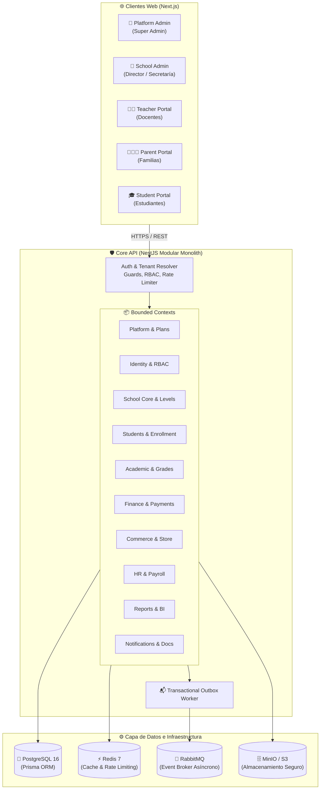
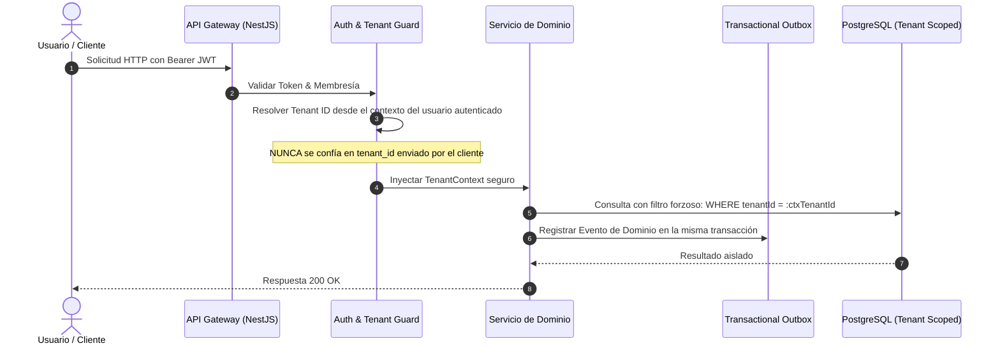
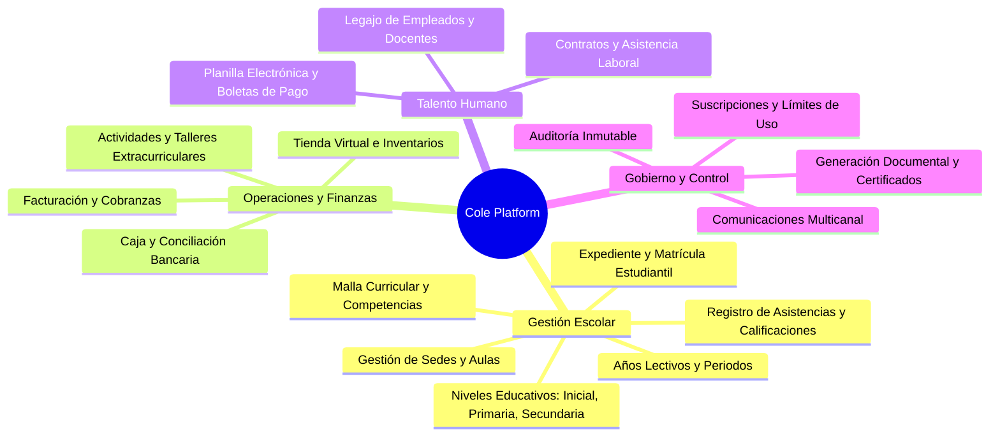

<div align="center">

# 🏫 Cole Platform
### Plataforma Integral de Gestión Educativa SaaS Multi-Tenant

[](https://www.typescriptlang.org/)
[](https://nestjs.com/)
[](https://nextjs.org/)
[](https://www.postgresql.org/)
[](https://www.prisma.io/)
[](https://www.docker.com/)
[](https://turbo.build/)

<p align="center">
  <b>Solución de software modular y de alto rendimiento diseñada para la administración integral de colegios e instituciones educativas en un entorno multi-inquilino (Multi-Tenant) seguro, escalable y auditable.</b>
</p>

[Arquitectura](#-arquitectura-del-sistema) •
[Módulos y Bounded Contexts](#-módulos-y-capacidades-del-sistema) •
[Multi-Tenancy y Seguridad](#-multi-tenancy-y-seguridad) •
[Guía de Inicio Rápido](#-guía-de-inicio-rápido) •
[Portales y Accesos](#-portales-y-aplicaciones) •
[Pruebas y Calidad](#-pruebas-y-calidad)

---

</div>

## 📌 Visión General

**Cole Platform** es una plataforma SaaS de grado empresarial concebida bajo los principios de **Domain-Driven Design (DDD)** y **Arquitectura Modular Limpia**. Permite gestionar todo el ciclo de vida escolar, desde admisiones y matrículas por niveles educativos (Inicial, Primaria y Secundaria), hasta finanzas, comercio escolar, recursos humanos, planillas y analítica predictiva.



---

## 🏗️ Arquitectura del Sistema

El proyecto está organizado como un **Monorepo gestionado con Turborepo y pnpm workspaces**, separando aplicaciones de frontend, el servicio central de API y paquetes de dominio compartidos.

### Estructura del Repositorio

```
cole-platform/
├── apps/
│   ├── web-platform-admin/     # Portal Super Admin (Gestión de Tenants y Planes)
│   ├── web-school-admin/       # Panel de Administración Escolar (Director, Secretaría, Tesorería)
│   ├── web-teacher-portal/     # Portal de Docentes (Asistencias, Calificaciones, Cursos)
│   ├── web-parent-portal/      # Portal para Familias (Pensiones, Seguimiento, Tienda)
│   └── web-student-portal/     # Portal de Estudiantes (Tareas, Evaluaciones, Horarios)
├── services/
│   └── core-api/               # API Central (NestJS 11 + Prisma + OpenAPI)
│       └── src/modules/
│           ├── platform/       # Aprovisionamiento de colegios, cuotas y suscripciones
│           ├── identity/       # Autenticación JWT, RBAC granular y sesiones
│           ├── school-core/    # Sedes, Años Lectivos, Periodos, Niveles (Inicial, Primaria, Secundaria)
│           ├── student/        # Expediente estudiantil, vínculos familiares
│           ├── enrollment/     # Admisiones y ciclo de vida de matrícula
│           ├── academic/       # Malla curricular, registro de notas, asistencia
│           ├── finance/        # Cobranzas, caja chica, pasarelas de pago, conciliación
│           ├── commerce/       # Tienda virtual de uniformes/útiles, inventario con bloqueo
│           ├── activity/       # Talleres extracurriculares, viajes, consentimientos
│           ├── hr/             # Legajo de colaboradores, contratos, control de asistencia laboral
│           ├── payroll/        # Cálculo y emisión de boletas de pago (AFP, ONP, ESSALUD)
│           ├── reporting/      # Cuadros de mando, métricas BI y reportes oficiales
│           ├── notification/   # Motor multicanal (Email, SMS, Push, In-App)
│           ├── document/       # Emisión de certificados PDF y gestión documental
│           ├── audit/          # Registro inmutable de auditoría forense
│           └── entitlement/    # Motor de gobernanza de características y límites
├── packages/
│   ├── database/               # Esquema Prisma, migraciones, scripts de seeding
│   ├── domain-types/           # Tipos de TypeScript compartidos, eventos y contratos
│   ├── logger/                 # Logging estructurado en formato JSON estándar
│   └── ui-components/          # Componentes visuales y primitives reutilizables
├── docker-compose.yml          # Servicios auxiliares de desarrollo
├── docker-compose.prod.yml     # Orquestación de contenedores para producción
└── turbo.json                  # Definición de pipelines de compilación y ejecución
```

---

## 🔒 Multi-Tenancy y Seguridad

El aislamiento estricto de datos por inquilino (*Tenant Isolation*) es una regla inviolable en Cole Platform:



### Reglas Clave de Seguridad y Negocio
1. **Contexto de Inquilino Aislado:** Todas las operaciones de lectura y mutación están acotadas automáticamente por el `tenantId` resuelto de la sesión del usuario.
2. **Inmutabilidad Financiera:** Los registros contables y de pagos jamás se eliminan físicamente (`hard-delete`). Toda corrección se realiza vía asientos de reversión, notas de crédito o ajustes auditados.
3. **Idempotencia Transaccional:** Las transacciones financieras y de compras admiten llaves de idempotencia para prevenir cobros duplicados en condiciones de concurrencia.
4. **Patrón Outbox Transaccional:** Los eventos de dominio se persisten en la misma transacción atómica de base de datos antes de publicarse asíncronamente al broker.
5. **Rate Limiting & Hardening:** Protección perimetral con Helmet, validación estricta de DTOs con `class-validator` y limitación de tasa por IP y por usuario.

---

## 📦 Módulos y Capacidades del Sistema



| Módulo | Responsabilidad Principal |
|---|---|
| **Platform & Entitlements** | Provisión de nuevos colegios, planes de suscripción, límites de alumnos/docentes y activación de add-ons. |
| **Identity & RBAC** | Autenticación robusta, roles (SuperAdmin, Director, Secretaría, Docente, Padre, Estudiante) y permisos granulares. |
| **School Core** | Estructura académica jerárquica: Sedes, Años Lectivos, Periodos (Bimestres/Trimestres) y Niveles (Inicial, Primaria, Secundaria). |
| **Students & Enrollment** | Registro único de estudiantes, parentesco familiar (Padres/Apoderados) y flujo completo de matrícula. |
| **Academic** | Asignación docente, diseño curricular por competencias, registro de calificaciones y control de asistencia diaria. |
| **Finance** | Conceptos de cobro, emisión masiva de pensiones, control de mora, caja diaria y reportes de recaudación. |
| **Commerce** | Catálogo de productos escolares, gestión de stock en tiempo real y pasarela de órdenes. |
| **Activities** | Inscripción en talleres deportivos/culturales, eventos, viajes de estudio y gestión de consentimientos firmados. |
| **HR & Payroll** | Control de personal docente/administrativo, contratos, asistencia laboral y cálculo automático de planillas. |
| **Reporting & BI** | Indicadores clave de rendimiento (KPIs), proyecciones de ingresos, retención escolar y exportación oficial. |
| **Notifications & Documents** | Mensajería dirigida vía correo/SMS/push y generación automatizada de boletas de notas y certificados PDF. |
| **Audit** | Bitácora inalterable de auditoría forense para todas las operaciones críticas de la plataforma. |

---

## 🚀 Guía de Inicio Rápido

### Prerrequisitos
- **Node.js:** Versión 20.x o superior
- **pnpm:** Versión 9.x o superior
- **Docker Desktop:** Activo para los servicios de base de datos e infraestructura

### 1. Clonar el repositorio y configurar variables de entorno

```bash
git clone https://github.com/Alessander9/SaasColegios.git
cd SaasColegios

# Copiar el archivo de ejemplo para desarrollo local
cp .env.example .env
```

> [!NOTE]
> Las variables por defecto de `.env.example` están preconfiguradas para funcionar directamente con el `docker-compose.yml` local.

### 2. Iniciar la infraestructura en segundo plano

```bash
docker compose up -d
```

Esto levantará los siguientes servicios locales:
- **PostgreSQL 16:** Puerto `5433` (BD: `cole_platform`)
- **Redis 7:** Puerto `6379`
- **RabbitMQ 3:** Puerto `5672` (Panel de Administración: `http://localhost:15672`)
- **MinIO S3:** Puerto `9000` (Consola Web: `http://localhost:9001`)

### 3. Instalar dependencias y compilar paquetes base

```bash
# Instalar dependencias en todo el monorepo
pnpm install

# Compilar paquetes de dominio compartidos y generar cliente Prisma
pnpm --filter @cole/domain-types build
pnpm --filter @cole/logger build
pnpm --filter @cole/database build
```

### 4. Ejecutar migraciones y datos de prueba (Seed)

```bash
# Aplicar migraciones a la base de datos
cd packages/database
npx prisma migrate deploy

# Poblar con datos de prueba (Colegio demo, alumnos por nivel, docentes, cursos y catálogo)
npx prisma db seed
cd ../..
```

### 5. Iniciar la plataforma en modo desarrollo

```bash
# Inicia todos los servicios y aplicaciones en paralelo
pnpm dev
```

O si prefieres iniciar componentes individuales:
```bash
# Iniciar solo el Backend API (Puerto 4000)
./start-backend.bat

# Iniciar el Administrador Escolar (Puerto 3001)
./start-frontend.bat
```

---

## 🌐 Portales y Aplicaciones

Una vez iniciado el entorno, puedes acceder a las distintas aplicaciones:

| Aplicación | URL | Descripción | Rol de Acceso |
|---|---|---|---|
| **School Admin Portal** | `http://localhost:3001` | Gestión directiva, matrículas, notas y finanzas | Director, Secretaría, Tesorería |
| **Platform Admin** | `http://localhost:3000` | Gestión de inquilinos, planes SaaS y facturación | Super Administrador |
| **Teacher Portal** | `http://localhost:3002` | Registro de notas, asistencias y clases | Docentes |
| **Parent Portal** | `http://localhost:3003` | Pago de pensiones, comunicados y notas | Padres / Apoderados |
| **Student Portal** | `http://localhost:3004` | Horarios, cursos, tareas y actividades | Estudiantes |
| **API Docs (Swagger)** | `http://localhost:4000/docs` | Especificación interactiva OpenAPI v3 | Desarrolladores / Integraciones |

---

## 🧪 Pruebas y Calidad

El proyecto cuenta con una suite completa de pruebas unitarias, de integración y de extremo a extremo (E2E):

```bash
# Ejecutar todas las pruebas unitarias del monorepo
pnpm test

# Ejecutar verificación de tipos TypeScript
pnpm typecheck

# Ejecutar pruebas específicas de un módulo (ej. Finanzas o Comercio)
cd services/core-api
pnpm jest --testPathPattern=finance
pnpm jest --testPathPattern=commerce

# Pruebas End-to-End con Playwright
pnpm e2e:browser
```

---

## 🛠️ Stack Tecnológico

<div align="center">

| Capa | Tecnologías Principales |
|---|---|
| **Backend & Core API** | NestJS 11, TypeScript 5.8, Express, RxJS, Class-Validator, Swagger |
| **Base de Datos & ORM** | PostgreSQL 16, Prisma ORM 6.4, Conexiones seguras con pooling |
| **Frontend Applications** | Next.js 15 (App Router), React 19, Vanilla CSS & Componentes Modulares |
| **Cache & Mensajería** | Redis 7 (Cache / Rate Limiter), RabbitMQ 3 (Broker de eventos asíncronos) |
| **Almacenamiento de Archivos** | MinIO / AWS S3 Compatible Storage |
| **Herramientas de Monorepo** | Turborepo, pnpm workspaces, ESLint, Prettier |
| **Testing & Automatización** | Jest, Supertest, Playwright, Selenium Webdriver |

</div>

---

## 📄 Licencia

Este proyecto está bajo licencia privada. Todos los derechos reservados © 2026 **Cole Platform**.
