# 📋 Manual de Flujos de Trabajo, Backlogs por Rol y Procesos Integrales

## Cole Platform — SaaS Educativo Multi-Tenant

---

## 📑 Tabla de Contenidos
1. [Ecosistema de Roles y Matriz de Restricciones (RBAC & Entitlements)](#1-ecosistema-de-roles-y-matriz-de-restricciones)
2. [Backlog Funcional por Rol](#2-backlog-funcional-por-rol)
3. [Guía Paso a Paso de Intervención por Rol](#3-guía-paso-a-paso-de-intervención-por-rol)
   - 3.1 [Super Administrador de Plataforma](#31-super-administrador-de-plataforma)
   - 3.2 [Director de Institución Educativa](#32-director-de-institución-educativa)
   - 3.3 [Secretaría Académica](#33-secretaría-académica)
   - 3.4 [Tesorero / Administrador Financiero](#34-tesorero--administrador-financiero)
   - 3.5 [Docente / Profesor de Asignatura](#35-docente--profesor-de-asignatura)
   - 3.6 [Gestor de Tienda Escolar](#36-gestor-de-tienda-escolar)
   - 3.7 [Padre de Familia / Apoderado](#37-padre-de-familia--apoderado)
   - 3.8 [Estudiante](#38-estudiante)
4. [Flujo General Integral (Intervención Secuencial de Todos los Roles)](#4-flujo-general-integral-ciclo-escolar-completo)
5. [Reglas Críticas de Negocio, Auditoría e Inmutabilidad](#5-reglas-críticas-de-negocio-auditoría-e-inmutabilidad)

---

## 1. Ecosistema de Roles y Matriz de Restricciones

El sistema opera bajo un modelo estricto de **Multi-Tenancy** y **RBAC (Role-Based Access Control)**. Ningún usuario puede acceder a datos de otro colegio ni ejecutar acciones fuera de sus permisos asignados o del plan de suscripción activo de su institución.

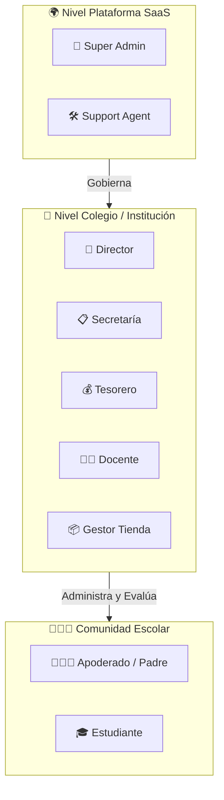

### Matriz de Permisos y Restricciones de Acceso

| Rol | Alcance (*Scope*) | Permisos Clave | Restricciones Inviolables |
|---|---|---|---|
| **Super Admin** | Multi-Tenant Global | `tenants.*`, `plans.*`, `overrides.*`, `audit.global` | No interviene en notas académicas ni cobros específicos salvo soporte auditado (*impersonation*). |
| **Director** | Tenant Propio | `school.*`, `academic.publish`, `hr.*`, `payroll.approve`, `reports.*` | No puede alterar límites del plan SaaS ni modificar logs de auditoría. |
| **Secretaría** | Tenant Propio | `students.*`, `enrollments.create`, `attendance.view`, `documents.generate` | No puede aprobar planillas de sueldos ni publicar actas finales de calificaciones. |
| **Tesorero / Caja** | Tenant Propio | `finance.collect`, `finance.refund`, `cashbox.*`, `charges.*` | Prohibido eliminar cobros históricos (*hard-delete*); solo reversiones y notas de crédito. |
| **Docente** | Tenant & Asignaciones | `grades.input`, `attendance.record`, `courses.view` | Solo accede a sus cursos y secciones asignadas; no puede modificar notas tras el cierre del periodo. |
| **Gestor Tienda** | Tenant Propio | `commerce.inventory`, `commerce.orders.process` | Sin acceso a registros académicos de estudiantes ni remuneraciones del personal. |
| **Padre / Apoderado** | Tenant & Hijos | `portal.parent`, `finance.pay`, `consents.sign`, `orders.create` | Solo visualiza información de sus hijos vinculados por DNI/Parentesco. |
| **Estudiante** | Tenant & Propio | `portal.student`, `evaluations.view`, `grades.view`, `activities.view` | Lectura exclusiva de sus notas publicadas, horario y material de clase. |

---

## 2. Backlog Funcional por Rol

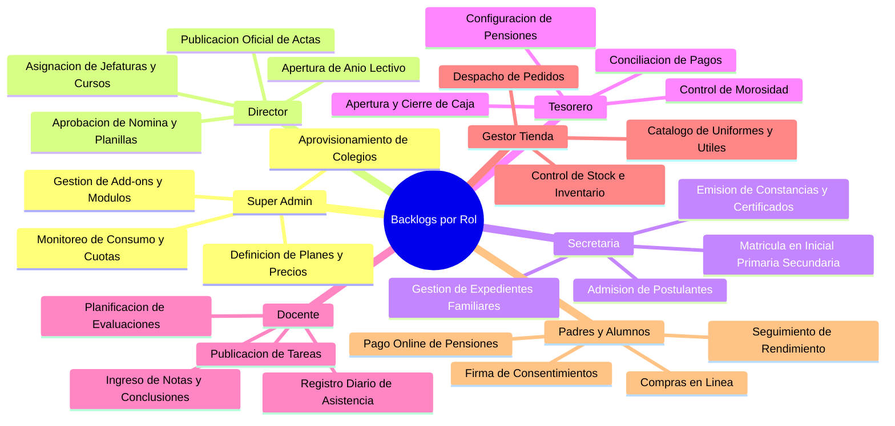

---

## 3. Guía Paso a Paso de Intervención por Rol

### 3.1 Super Administrador de Plataforma
**Objetivo:** Habilitar a un nuevo cliente escolar en la infraestructura SaaS con su plan y características contratadas.

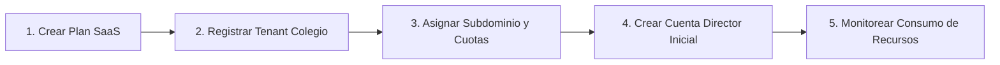

1. **Definición de Oferta Comercial:** Crea el plan (ej. *Básico*, *Profesional*, *Enterprise*) especificando límites de estudiantes, docentes y módulos habilitados (`FeatureKey`).
2. **Aprovisionamiento del Tenant:** Registra la institución (ej. *Colegio San José*), asignando su subdominio (`sanjose.cole.pe`) y slug único.
3. **Configuración de Identidad Raíz:** Crea el usuario del Director y genera el enlace de bienvenida con credenciales iniciales.
4. **Gobierno de Cuotas:** Aplica *Overrides* o *Add-ons* en caso de requerir almacenamiento extra o incremento de cupo de alumnos.
5. **Cierre de Intervención:** El colegio queda en estado `ACTIVE` listo para operar de manera autónoma.

---

### 3.2 Director de Institución Educativa
**Objetivo:** Establecer las directrices operativas, año académico, asignaciones docentes y gobierno general.

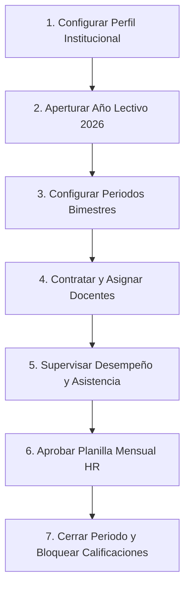

1. **Configuración Institucional:** Define RUC, razón social, logo, zonas horarias y escala de evaluación (ej. `NUMERIC_0_20` o `LITERAL_AD_A_B_C`).
2. **Apertura de Año Lectivo:** Crea el año académico (ej. *2026*), fijando fechas de inicio/fin y creando los periodos (1° al 4° Bimestre).
3. **Estructura Escolar:** Valida los niveles educativos (**Inicial**, **Primaria**, **Secundaria**), grados y secciones con sus aforos máximos.
4. **Gestión de Personal (HR):** Registra docentes y personal administrativo con sus contratos laborales y salarios base.
5. **Asignación Académica:** Asocia a los profesores con sus respectivas materias y secciones (`CourseSection`).
6. **Cierre de Periodo:** Revisa el informe consolidado, aprueba planillas y ejecuta el bloqueo oficial de actas (`lockPeriod`).

---

### 3.3 Secretaría Académica
**Objetivo:** Gestionar el ciclo de vida del alumnado y las familias desde la postulación hasta la graduación.

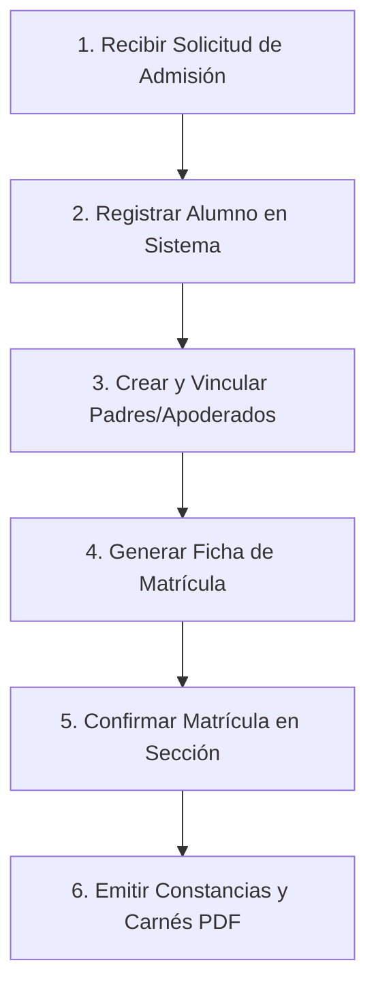

1. **Admisión:** Registra datos del estudiante postulante (DNI, fecha de nacimiento, género, dirección).
2. **Vinculación Familiar:** Crea o asocia el registro del padre/madre/apoderado con parentesco (`FATHER`, `MOTHER`, `LEGAL_GUARDIAN`).
3. **Asignación de Grado y Sección:** Selecciona el grado educativo (Inicial 5 Años, 1er Grado Primaria, 5to Año Secundaria) y la sección correspondiente.
4. **Confirmación de Matrícula:** Al validarse los requisitos y pago inicial, cambia el estado a `CONFIRMED`, generando el código correlativo de matrícula (`MAT-2026-XXXX`).
5. **Documentación:** Genera constancias de estudio y nóminas oficiales en PDF a través del módulo de documentos.

---

### 3.4 Tesorero / Administrador Financiero
**Objetivo:** Garantizar la recaudación, control de caja, conciliación bancaria y gestión de cuentas por cobrar.

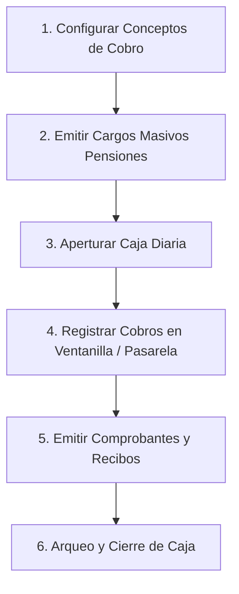

1. **Definición Tarifaria:** Crea los conceptos de cobro (Matrícula, Pensión Marzo-Diciembre, Talleres, Seguro Escolar).
2. **Emisión de Cargos:** Genera las obligaciones mensuales para todos los estudiantes matriculados (`charges`).
3. **Operación de Caja:** Abre turno de caja diario registrando saldo inicial.
4. **Recaudación y Conciliación:** Procesa pagos en efectivo, transferencias o pasarela online, vinculando la transacción con idempotencia.
5. **Gestión de Mora:** Emite reportes de alumnos deudores y envía recordatorios de pago automáticos vía email/SMS.
6. **Cierre de Caja:** Realiza arqueo diario y bloquea el turno contable sin posibilidad de alteración retroactiva.

---

### 3.5 Docente / Profesor de Asignatura
**Objetivo:** Planificar el currículo por competencias, registrar la asistencia diaria y asentar calificaciones.

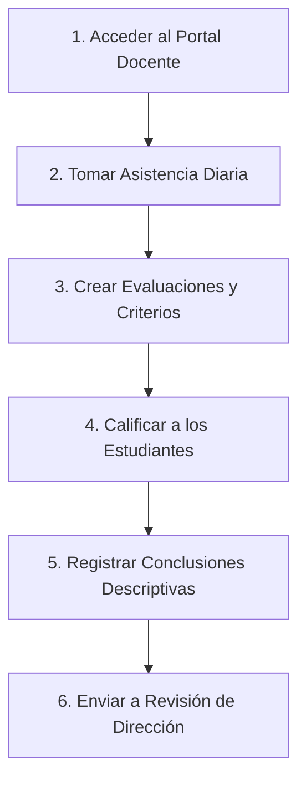

1. **Ingreso al Portal:** Visualiza sus cursos asignados (ej. *Matemática 5to Secundaria*, *Comunicación 1er Grado Primaria*).
2. **Control de Asistencia:** Marca asistencia por sección en cada bloque horario (`PRESENT`, `LATE`, `ABSENT`, `JUSTIFIED`).
3. **Diseño de Evaluaciones:** Crea exámenes, prácticas y tareas vinculadas a las competencias curriculares.
4. **Calificación:** Ingresa notas numéricas o literales para cada estudiante.
5. **Conclusión Cualitativa:** Redacta conclusiones descriptivas para los estudiantes con dificultades académicas.
6. **Firma Digital/Cierre:** Envía notas para publicación oficial antes de la fecha límite fijada por Dirección.

---

### 3.6 Gestor de Tienda Escolar
**Objetivo:** Administrar el comercio virtual y presencial de uniformes, libros y útiles escolares.

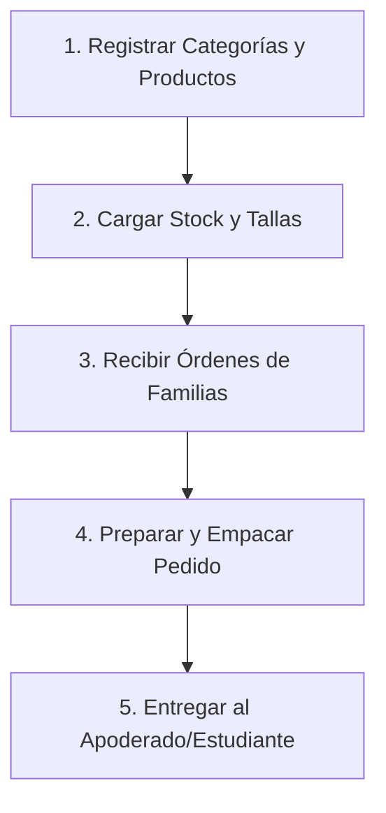

1. **Gestión de Catálogo:** Publica productos con sus variantes (tallas de uniformes, ediciones de libros).
2. **Control de Inventario:** Registra ingresos de mercadería y ajusta existencias con control de movimientos auditables.
3. **Atención de Pedidos:** Recibe notificaciones de órdenes pagadas desde el Portal de Padres.
4. **Despacho:** Actualiza estado de orden (`PAID` → `PREPARING` → `READY_FOR_PICKUP` → `COMPLETED`).

---

### 3.7 Padre de Familia / Apoderado
**Objetivo:** Supervisar el avance académico de sus hijos, pagar obligaciones financieras y adquirir servicios.

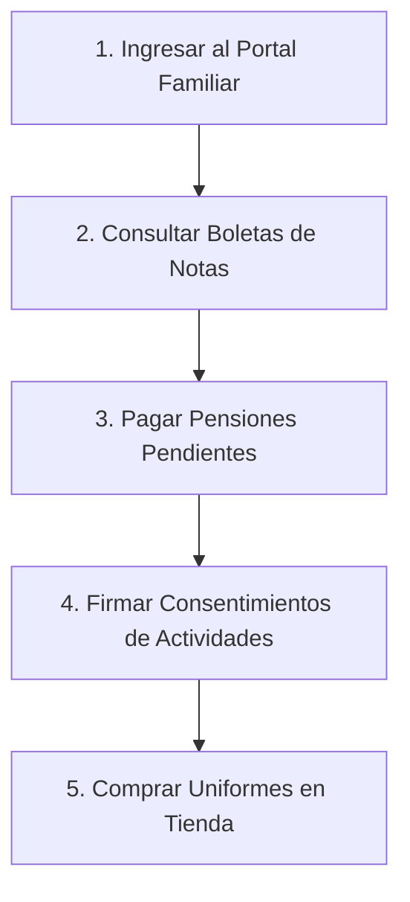

1. **Acceso Familiar:** Ingresa con su cuenta y selecciona a cuál de sus hijos desea consultar.
2. **Monitoreo Académico:** Visualiza notas publicadas, asistencias diarias y observaciones de docentes.
3. **Pagos:** Consulta deudas pendientes y realiza el pago con tarjeta o transferencia.
4. **Autorizaciones:** Firma digitalmente consentimientos para salidas pedagógicas o paseos escolares.
5. **Tienda:** Realiza pedidos de uniformes o materiales escolares desde la comodidad de su hogar.

---

### 3.8 Estudiante
**Objetivo:** Cumplir con sus actividades formativas, consultar horarios y dar seguimiento a su rendimiento.

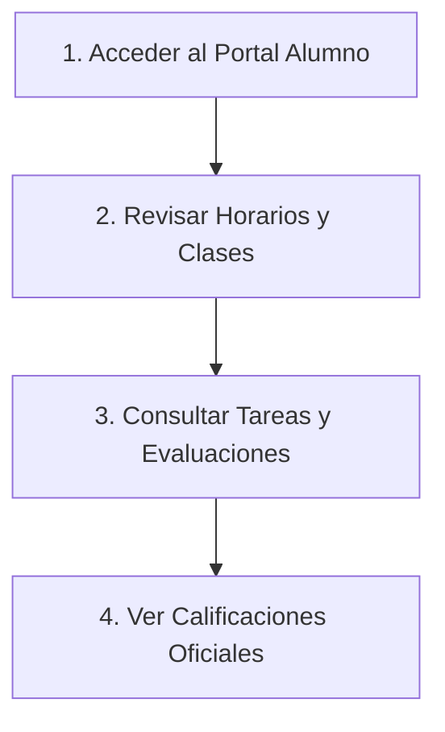

1. **Portal del Alumno:** Consulta su horario semanal, profesores a cargo y avisos escolares.
2. **Seguimiento Académico:** Revisa calificaciones una vez que han sido oficialmente publicadas.
3. **Actividades:** Consulta los talleres y actividades extracurriculares en los que se encuentra inscrito.

---

## 4. Flujo General Integral (Ciclo Escolar Completo)

Este diagrama orquesta la interacción cronológica de **todos los roles** a lo largo del año académico:

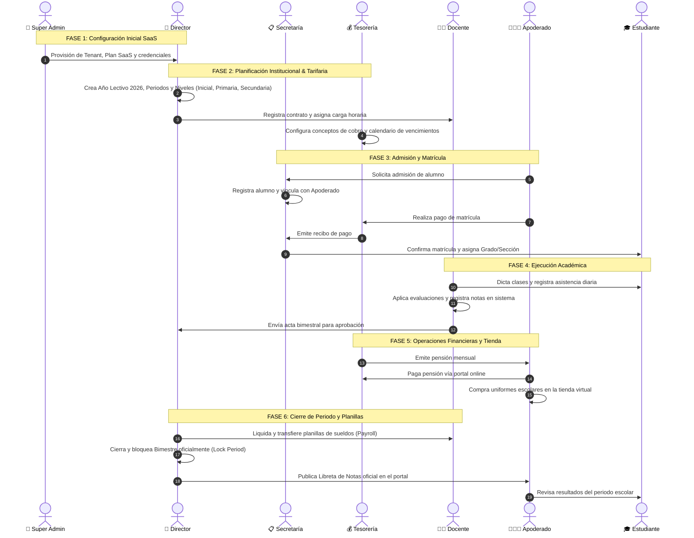

---

## 5. Reglas Críticas de Negocio, Auditoría e Inmutabilidad

1. **Aislamiento Multi-Inquilino Mandatorio:** Toda consulta a la base de datos incluye la cláusula `tenantId = :tenantId` inyectada desde la sesión del usuario.
2. **Cero Borrado Físico en Finanzas:** Las tablas `charges`, `payments`, `cash_boxes`, `enrollments` y `grade_records` no se eliminan físicamente. Cualquier corrección requiere una transacción de ajuste o reversión.
3. **Idempotencia en Pagos:** Toda llamada de cobro requiere un `idempotencyKey` para evitar cargos duplicados ante reintentos de red.
4. **Bloqueo Académico Inmutable:** Una vez que el Director ejecuta `POST /api/v1/academic/periods/lock`, ningún docente puede alterar notas del periodo cerrado sin una autorización especial de auditoría.
5. **Auditoría Transaccional:** Cada mutación sensible dispara un registro en `audit_logs` que captura el `actorId`, `action`, `resource`, `ipAddress` y los estados `before`/`after`.
